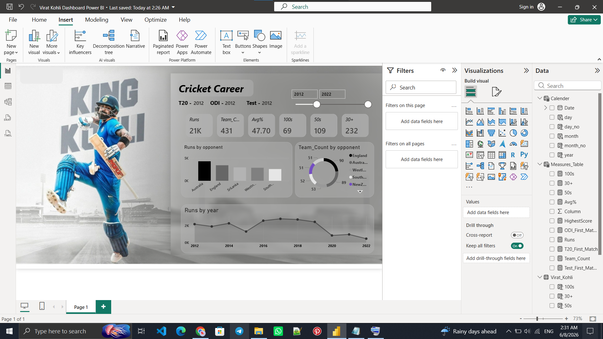
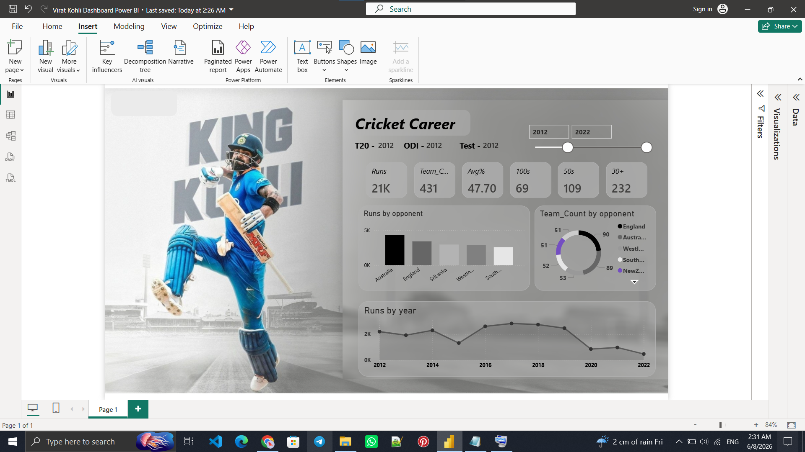

# 🏏 Virat Kohli Career Analytics Dashboard | Power BI

## 📌 Project Overview

This Power BI dashboard provides a comprehensive analysis of Virat Kohli's international cricket career. The dashboard transforms raw cricket statistics into meaningful visual insights, allowing users to explore performance trends, batting achievements, opponent-wise records, and career milestones through interactive visualizations.

Designed for cricket enthusiasts, sports analysts, data analysts, and Power BI learners, this project demonstrates how sports data can be effectively visualized to uncover patterns and performance indicators.

---

## 🎯 Objectives

- Analyze Virat Kohli's career performance using interactive dashboards.
- Track batting achievements and consistency over time.
- Compare performances against different opponents.
- Visualize yearly run-scoring trends.
- Showcase important career milestones and debut information.

---

## 📊 Dashboard Features

### 🔹 Key Performance Indicators (KPIs)

- Total Runs
- Total Matches Played
- Batting Average
- Total Centuries (100s)
- Total Half-Centuries (50s)
- 30+ Score Count

### 🔹 Opponent Analysis

- Runs scored against different teams
- Opponent-wise performance comparison
- Match distribution by opposition

### 🔹 Trend Analysis

- Year-wise run progression
- Performance growth across career years
- Consistency and peak-performance periods

### 🔹 Career Milestones

- Test Debut Information
- ODI Debut Information
- T20I Debut Information

### 🔹 Interactive Filtering

- Year Slicer
- Dynamic visual interactions
- Drill-down analysis

---

## 🛠 Tools & Technologies

| Tool | Purpose |
|--------|---------|
| Power BI | Data Visualization |
| DAX | Measures & Calculations |
| Power Query | Data Transformation |
| Excel / CSV Dataset | Source Data |

---

## 📈 Visualizations Used

- KPI Cards
- Clustered Column Chart
- Donut Chart
- Stacked Area Chart
- Interactive Slicers
- Custom Dashboard Design

---

## 📷 Dashboard Preview

---

## 🚀 Key Insights

- Identify Virat Kohli's strongest opponents.
- Analyze scoring consistency throughout his career.
- Observe yearly performance trends.
- Evaluate batting achievements through milestones and records.
- Explore career progression through interactive filtering.

---

## 🎓 Learning Outcomes

This project demonstrates:

- Power BI Dashboard Development
- Data Modeling
- DAX Measure Creation
- Sports Analytics
- Data Storytelling
- Interactive Report Design

---

## 👨‍💻 Author

Developed as a Power BI Data Analytics Project to showcase sports performance analytics and dashboard development skills.

---

## ⭐ If you found this project useful

Please consider giving the repository a star ⭐ and sharing your feedback.
